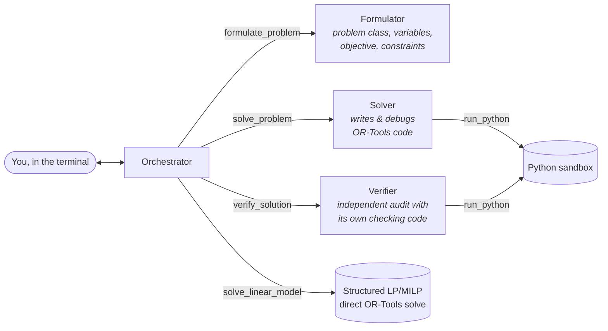

# optimist

**Natural language in, solved models out.** `optimist` is a multi-agent terminal
assistant for optimization work: describe an optimization, scheduling, routing,
packing, or constraint-satisfaction problem in plain language (attach a PDF or a
photo of the data if you like), and a team of LLM agents formulates it as a
formal model, solves it with [Google OR-Tools](https://developers.google.com/optimization),
independently verifies the result, and explains the solution back in plain language.

This repository began as `llm_jssp`, an early experiment in pairing an LLM with a
job-shop scheduling solver; `optimist` is the full realization of that idea.

## How it works

The user talks to one agent, the **Orchestrator**. Its tools either do direct
solver work or spawn a fresh specialist agent:



- **Formulator** turns the problem statement into a precise formulation:
  problem class (LP, MILP, CP-SAT, scheduling, …), sets and parameters,
  decision variables, objective, constraints, recommended solver strategy.
  Missing data becomes an explicit question back to you, not a guess.
- **Solver** implements the formulation with OR-Tools (CP-SAT for
  combinatorial/scheduling structure, GLOP/SCIP for linear models), runs it in
  a sandboxed subprocess, reads tracebacks, and iterates until it solves.
- **Verifier** is an adversarial auditor: it writes *its own* checking code to
  recompute feasibility and the objective against the original statement, and
  reports `VERIFIED` or precisely which constraint is violated and by how much.
- Small, plainly linear problems skip code generation entirely: the
  orchestrator emits a structured spec that is validated (pydantic) and solved
  directly.

Two pieces of shared infrastructure make the team dependable across the whole
OR-Tools surface:

- **A persistent session workspace.** Every `run_python` call executes in the
  same per-session directory. Attached data files (CSV/JSON/TXT) are copied
  there and read by solver code directly, so instance size is not capped by
  the context window; the model sees only a preview. Artifacts persist across
  runs (the Solver writes `solution.json`; the Verifier reads it and the
  original data files rather than trusting re-typed numbers), and every
  generated script is kept, numbered, for auditability.
- **A verified recipe library.** The Formulator and Solver hold a
  `read_recipe` tool serving a cookbook of current OR-Tools idioms with
  complete examples: CP-SAT fundamentals (including infeasibility diagnosis
  via assumptions and solution enumeration), scheduling with intervals and
  cumulative resources, TSP/VRP with the routing library, network flows and
  assignment, LP/MILP with sensitivity analysis (duals, reduced costs), and
  knapsack/bin packing. The test suite executes every code block in every
  recipe against the installed OR-Tools version, so the idioms agents copy
  are tested fact, not training-data recollection.

Every number in the final answer traces back to a solver run in the transcript;
the orchestrator is instructed never to fabricate results, and the verifier
exists to catch it (and the solver) if they do.

## Installation

Requires Python 3.11+.

```bash
pip install git+https://github.com/andreimr/llm_jssp
```

Set credentials for the provider(s) you want:

```bash
export ANTHROPIC_API_KEY=sk-ant-...     # for claude-* models (default)
export OPENROUTER_API_KEY=sk-or-...     # for any OpenRouter model
```

## Usage

```bash
optimist                      # interactive REPL
optimist -m claude-sonnet-5   # pick a model
optimist --attach data.pdf "assign contractors to lots at minimum total cost"
```

In the REPL, plain text goes to the agent team; slash commands control the app:

| Command | Effect |
| --- | --- |
| `/model [id]` | show or set the model — `claude-*` ids use Anthropic, `vendor/model` ids use OpenRouter |
| `/models [filter]` | list available models from both providers |
| `/subagent-model [id]` | run the sub-agents on a cheaper/faster model |
| `/attach <path>` | attach a PDF or image (model-visible) or a data file (.csv/.tsv/.json/.txt — copied to the workspace for solver code) |
| `/workspace` | show the session's working directory and its files |
| `/thinking on\|off` | stream model reasoning summaries |
| `/save [path]` | save the conversation as markdown |
| `/usage` | token usage for the session |
| `/clear`, `/exit` | reset conversation / quit |

Example session:

```text
optimist> I run a bakery. I have 50 kg flour, 20 kg butter and 30 kg sugar.
          A croissant batch uses 2/1/0.5 kg and earns $40; a cake batch uses
          1/0.5/1 kg and earns $30. Whole batches only. What should I bake?

  ● formulate_problem  …
  ◆ Formulator done (1 turn)
  ● solve_problem  …
  ◆ Solver done (3 turns)
  ● verify_solution  …
  ◆ Verifier done (2 turns)

Bake 20 croissant batches and 10 cake batches for a profit of $1,100. …
```

More worked examples live in [`examples/problems.md`](examples/problems.md).

### Model selection

- Anthropic: `claude-opus-5` (default), `claude-sonnet-5`, `claude-fable-5`,
  `claude-haiku-4-5`, … On Claude Opus 5 / Fable 5, optimist automatically opts
  into Anthropic's server-side refusal fallbacks so a safety-classifier decline
  is retried transparently on a fallback model.
- OpenRouter: any tool-calling model, e.g. `/model deepseek/deepseek-v4`.
  PDFs are text-extracted for OpenRouter models (no native PDF input); images
  pass through for vision-capable models.

Defaults can be persisted in `~/.config/optimist/config.toml`:

```toml
model = "claude-opus-5"
subagent_model = "claude-sonnet-5"   # run the heavy lifting on a cheaper model
```

## Architecture notes

- `optimist/messages.py` — provider-neutral conversation model; assistant turns
  keep the raw provider payload so Anthropic thinking blocks replay verbatim.
- `optimist/providers/` — streaming backends: Anthropic (native PDF/vision,
  adaptive thinking, prompt caching on the system prompt) and OpenRouter
  (OpenAI-compatible tool-call streaming).
- `optimist/agents/runtime.py` — one generic agent loop powers the orchestrator
  and every sub-agent: uniform streaming, tool dispatch, error containment,
  usage accounting, turn caps.
- `optimist/tools/sandbox.py` — solver code runs in a subprocess with wall-clock
  timeout plus CPU/memory rlimits, inside the persistent session workspace. It
  is a resource sandbox, not a security boundary.
- `optimist/tools/lp.py` — validated structured LP/MILP path (pydantic spec →
  OR-Tools GLOP/SCIP/CBC).
- `optimist/recipes/` — the verified OR-Tools cookbook served by `read_recipe`;
  every code block is executed by the tests.

## Development

```bash
git clone https://github.com/andreimr/llm_jssp && cd llm_jssp
pip install -e '.[dev]'
pytest          # no network or API keys needed
ruff check optimist tests
```

The test suite covers the LP solver path, the sandbox (timeouts, OR-Tools
importability, workspace persistence), provider wire-format conversion for both
backends, the agent loop end-to-end against a scripted fake provider, and every
code block in the recipe library.

## License

MIT
